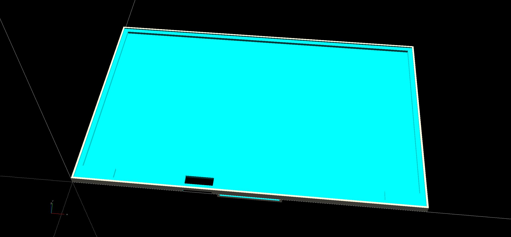

# SCAD-files

使用 [openscad](https://openscad.org/) 建模设计的 3D 文件。

### 13.3 寸 DIY 显示器外壳

[display-case(mnd307da1-2).scad](13.3-inch-diy-display-case/display-case(mnd307da1-2).scad)，屏幕型号 mnd307da1-2。

模型预览

### 15.6 寸 DIY 显示器外壳

[display-case(NE156QUM-N66)-with-cover.scad](15.6-inch-diy-display-case/display-case(NE156QUM-N66)-with-cover.scad)，屏幕型号 NE156QUM-N66。

模型预览

